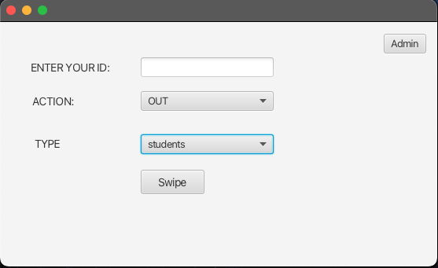
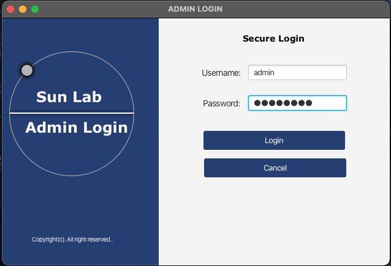
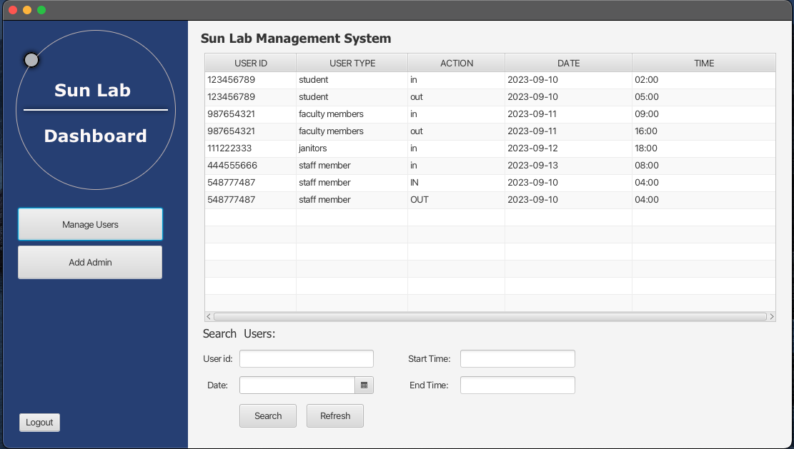
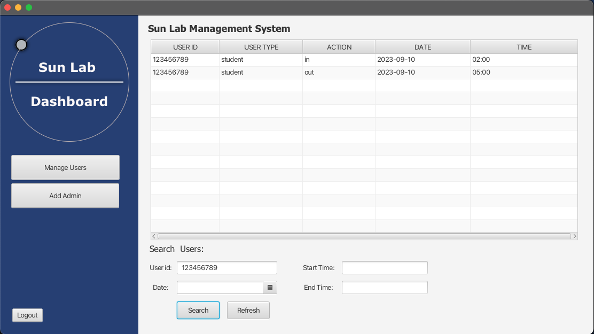
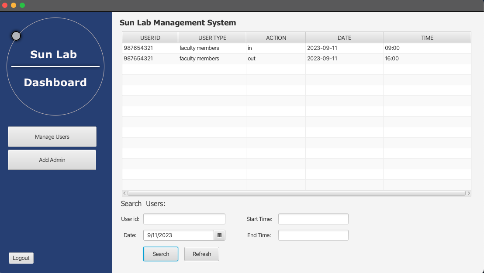
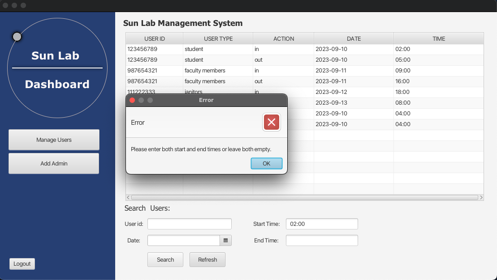
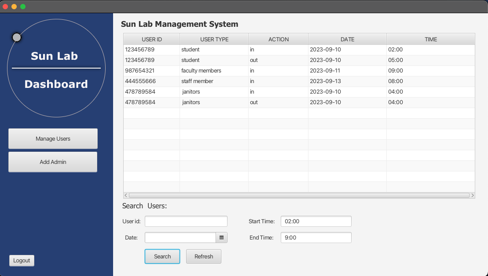

------------------------Sun lab access system -----------------------------------

    - This is a simple Sun lab access system. It has been written in Java with the user interface
      implemented in JavaFX. The system is designed to be used by the lab administrator to manage the
      lab access. For now, the admin can only seach user by their id, date, and time range. 

    - The application can be extended to allow more functionalities such us adding a new admin and
      more importantly, managing user access to the lab.

    The user and the admin have access to the same window but only the admin can click
    the admin button to login to the dashboard where he/she can see all data related to
    to all users. The admin can also search for a user by their id, or date, or time range.

    - We have some simple screenshots of the application
 
----------------------- User swipe interface ------------------------------------>

----------------------- Admin login interface ------------------------------------>

----------------------- Admin dashboard interface ------------------------------------>

----------------------- Search by id ------------------------------------>
'

----------------------- Search by date ------------------------------------>

----------------------- Search by time error ------------------------------------>

----------------------- Search by time ------------------------------------>

